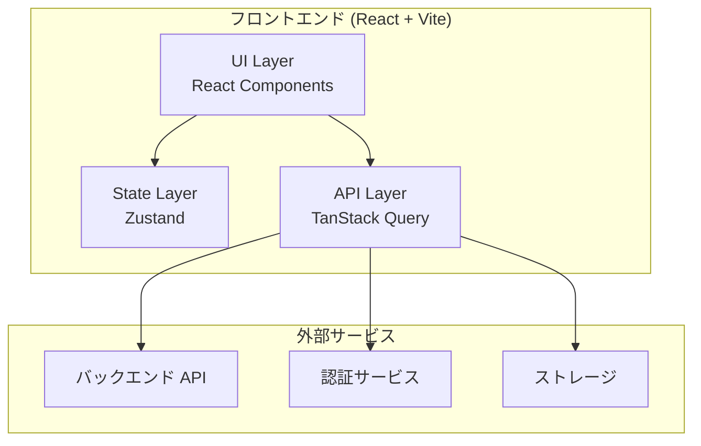
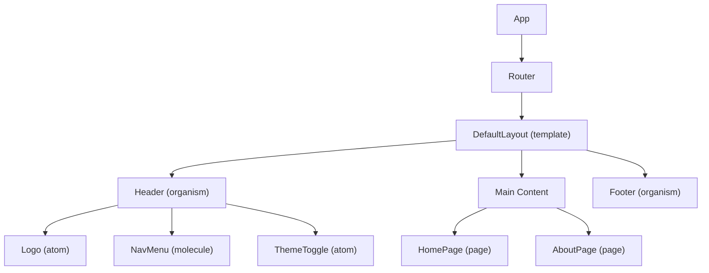
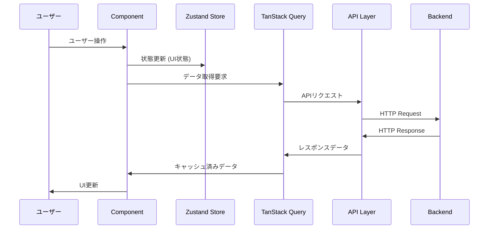
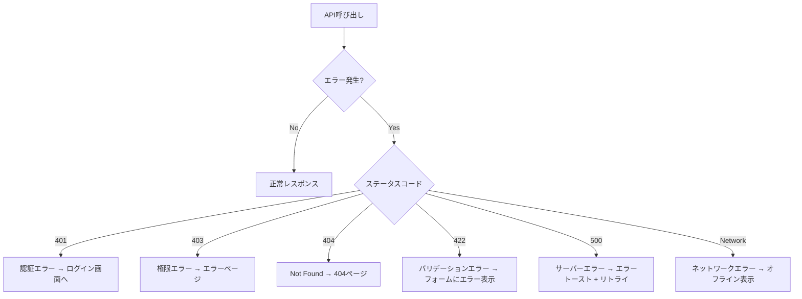

# 技術設計書テンプレート

> **カテゴリ**: 仕様書テンプレート
> **前提**: React + TypeScript + TailwindCSS + アトミックデザイン
> **難易度**: ★★★★☆
> **所要時間目安**: 30〜60分

## このプロンプトの使い方

要件定義書の作成後、技術設計の詳細を決める段階で使用します。AIエージェントに要件定義書（REQUIREMENTS.md）と一緒に渡すことで、整合性のある技術設計書を生成します。

---

## プロンプト

````text
要件定義書（REQUIREMENTS.md）を参照し、以下のテンプレートに従って技術設計書を作成してください。
TECHNICAL_DESIGN.md として保存してください。

━━━━━━━━━━━━━━━━━━━━━━━━━━━━━━
■ 技術設計書テンプレート
━━━━━━━━━━━━━━━━━━━━━━━━━━━━━━

```markdown
# 技術設計書

## 1. アーキテクチャ概要

### 1.1 システム構成図

（Mermaid でシステム全体の構成図を記述する）



### 1.2 技術選定と理由

| カテゴリ | 採用技術 | 比較した候補 | 選定理由 |
|---------|---------|------------|---------|
| UI フレームワーク | React 18 | Vue 3, Svelte | |
| 言語 | TypeScript | JavaScript | |
| ビルドツール | Vite | Webpack, Turbopack | |
| スタイリング | TailwindCSS | CSS Modules, styled-components | |
| 状態管理 | Zustand | Redux Toolkit, Jotai | |
| データ取得 | TanStack Query | SWR, Apollo Client | |
| ルーティング | React Router v6 | TanStack Router | |
| フォーム | React Hook Form + Zod | Formik + Yup | |
| テスト | Vitest + RTL + Playwright | Jest, Cypress | |

---

## 2. ディレクトリ構成

### 2.1 全体構成

```
src/
├── components/           # アトミックデザインに基づくコンポーネント
│   ├── atoms/            # 最小単位のUIパーツ
│   ├── molecules/        # atoms を組み合わせた小コンポーネント
│   ├── organisms/        # molecules を組み合わせたセクション
│   ├── templates/        # ページレイアウト
│   └── pages/            # ルーティング対象のページ
├── hooks/                # カスタムフック
├── stores/               # Zustand ストア
├── services/             # API通信・外部サービス連携
├── utils/                # 汎用ユーティリティ関数
├── types/                # 型定義ファイル
├── styles/               # グローバルCSS
├── constants/            # 定数定義
├── assets/               # 画像・フォント等の静的アセット
├── App.tsx               # アプリケーションルート
├── main.tsx              # エントリーポイント
└── vite-env.d.ts         # Vite 型定義
```

### 2.2 命名規則

| 対象 | 規則 | 例 |
|------|------|-----|
| コンポーネントファイル | PascalCase | `UserCard.tsx` |
| コンポーネントディレクトリ | PascalCase (※index.tsxパターン使用時) | `UserCard/index.tsx` |
| カスタムフック | camelCase + use prefix | `useAuth.ts` |
| ユーティリティ | camelCase | `formatDate.ts` |
| 型定義 | PascalCase | `User.ts` |
| 定数ファイル | camelCase | `apiEndpoints.ts` |
| 定数エクスポート名 | UPPER_SNAKE_CASE | `MAX_RETRY_COUNT` |
| テストファイル | 対象ファイル名 + `.test` | `UserCard.test.tsx` |

---

## 3. コンポーネント設計

### 3.1 コンポーネントツリー

（Mermaid でコンポーネントの親子関係を図示する）



### 3.2 主要コンポーネント一覧

| 階層 | コンポーネント名 | 責務 | Props |
|------|---------------|------|-------|
| atom | Button | 汎用ボタン | variant, size, disabled, onClick, children |
| atom | Input | テキスト入力 | type, placeholder, value, onChange, error |
| molecule | SearchBar | 検索フォーム | onSearch, placeholder |
| organism | Header | ヘッダーナビ | - |
| template | DefaultLayout | 共通レイアウト | children |
| page | HomePage | トップページ | - |

---

## 4. 状態管理設計

### 4.1 状態の分類

| 分類 | 管理方法 | 例 |
|------|---------|-----|
| サーバー状態 | TanStack Query | ユーザー一覧、投稿データ |
| グローバルUI状態 | Zustand | テーマ、サイドバー開閉、認証状態 |
| ローカルUI状態 | useState | フォーム入力値、モーダル開閉 |
| URL状態 | React Router | ページ、検索パラメータ |
| 永続化状態 | Zustand + persist | テーマ設定、言語設定 |

### 4.2 ストア設計

```typescript
// 例: テーマストア
interface ThemeStore {
  theme: 'light' | 'dark' | 'system';
  setTheme: (theme: ThemeStore['theme']) => void;
}

// 例: 認証ストア
interface AuthStore {
  user: User | null;
  isAuthenticated: boolean;
  login: (credentials: LoginCredentials) => Promise<void>;
  logout: () => void;
}
```

---

## 5. データフロー

### 5.1 データフロー図



### 5.2 エラーハンドリングフロー



---

## 6. ルーティング設計

### 6.1 ルート一覧

| パス | コンポーネント | レイアウト | 認証 | 説明 |
|------|-------------|----------|------|------|
| `/` | `HomePage` | DefaultLayout | 不要 | トップページ |
| `/login` | `LoginPage` | AuthLayout | 不要 | ログイン |
| `/register` | `RegisterPage` | AuthLayout | 不要 | 新規登録 |
| `/dashboard` | `DashboardPage` | DashboardLayout | 必要 | ダッシュボード |
| `/*` | `NotFoundPage` | DefaultLayout | 不要 | 404 |

### 6.2 ルートガード

```typescript
// 認証ガードの設計
// - 未認証ユーザー → /login にリダイレクト
// - 認証済みユーザーがログインページ → /dashboard にリダイレクト
// - ProtectedRoute コンポーネントとして実装
```

---

## 7. API設計

### 7.1 API通信レイヤー

- ベースURL: 環境変数 `VITE_API_BASE_URL` で管理
- 認証: Authorization ヘッダーに Bearer トークンを自動付与
- エラーハンドリング: インターセプターで共通処理
- リトライ: TanStack Query の retry オプションで自動リトライ（最大3回）

### 7.2 エンドポイント一覧

| メソッド | パス | 概要 | リクエスト | レスポンス |
|---------|------|------|-----------|-----------|
| | | | | |

---

## 8. セキュリティ設計

### 8.1 フロントエンドセキュリティ

| 脅威 | 対策 |
|------|------|
| XSS | React のデフォルトエスケープ、dangerouslySetInnerHTML 禁止 |
| CSRF | SameSite Cookie、CSRFトークン |
| 機密情報漏洩 | 環境変数（VITE_ プレフィックス）、.gitignore |
| 依存関係脆弱性 | npm audit、Dependabot |
| 不正アクセス | ルートガード、API認証 |

---

## 9. テスト戦略

### 9.1 テストピラミッド

| レベル | ツール | 対象 | カバレッジ目標 |
|--------|------|------|-------------|
| 単体テスト | Vitest | ユーティリティ関数、カスタムフック | 80% |
| コンポーネントテスト | Vitest + RTL | atoms, molecules | 70% |
| 結合テスト | Vitest + RTL | organisms, pages | 60% |
| E2Eテスト | Playwright | 主要ユーザーフロー | 主要フロー100% |

---

## 10. パフォーマンス戦略

| 施策 | 手法 | 対象 |
|------|------|------|
| コード分割 | React.lazy + Suspense | ページ単位 |
| 画像最適化 | WebP変換、lazy loading | 全画像 |
| キャッシュ | TanStack Query staleTime | APIレスポンス |
| バンドル最適化 | Tree-shaking、動的インポート | 全体 |
| レンダリング最適化 | React.memo、useMemo、useCallback | 重いコンポーネント |

---

## 11. 更新履歴

| 日付 | 版 | 更新者 | 内容 |
|------|-----|--------|------|
| YYYY-MM-DD | 1.0 | | 初版作成 |
```

━━━━━━━━━━━━━━━━━━━━━━━━━━━━━━
■ 作成時の注意事項
━━━━━━━━━━━━━━━━━━━━━━━━━━━━━━
- REQUIREMENTS.md との整合性を必ず確認すること
- Mermaid 図は正しい構文で記述すること
- 型定義の例は実際のプロジェクトに合わせて具体化すること
- すべてのセクションを埋めること。不明な箇所は「（要確認）」と記載する
- 完成後、AGENTS.md の規約に照らし合わせてセルフチェックを行い、結果を報告する
````

---

## カスタマイズポイント

| 箇所 | 説明 |
|------|------|
| システム構成図 | バックエンド構成に応じて Mermaid 図を変更 |
| 技術選定 | プロジェクト要件に応じてライブラリを変更 |
| テストカバレッジ目標 | プロジェクトの重要度に応じて調整 |
| パフォーマンス目標 | ターゲットユーザーの回線速度等を考慮 |

---

## 関連プロンプト

- [要件定義書テンプレート](./01_requirements-definition.md) — 技術設計の前提となる要件を定義
- [API仕様書テンプレート](./04_api-specification.md) — API設計の詳細化に使用
- [コンポーネント仕様書テンプレート](./05_component-specification.md) — コンポーネント設計の詳細化に使用
- [デザインシステム構築](../03_architecture-prompts/01_design-system.md) — デザイントークンの具体化に使用
