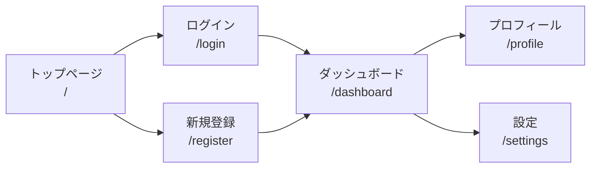

# UI/UX 仕様書テンプレート

> **カテゴリ**: 仕様書テンプレート
> **前提**: React + TypeScript + TailwindCSS + アトミックデザイン
> **難易度**: ★★★☆☆
> **所要時間目安**: 30〜60分

## このプロンプトの使い方

画面設計の段階で、各画面のレイアウト・インタラクション・レスポンシブ仕様を詳細に定義するために使用します。要件定義書の画面一覧を基に、AIエージェントに渡してください。

---

## プロンプト

````text
要件定義書（REQUIREMENTS.md）の画面一覧を参照し、以下のテンプレートに従ってUI/UX仕様書を作成してください。
UI_UX_SPEC.md として保存してください。

━━━━━━━━━━━━━━━━━━━━━━━━━━━━━━
■ UI/UX 仕様書テンプレート
━━━━━━━━━━━━━━━━━━━━━━━━━━━━━━

```markdown
# UI/UX 仕様書

## 1. デザイン原則

### 1.1 ビジュアルスタイル
- **テーマ**: モダン / ミニマル / グラスモーフィズム
- **トーン**: プロフェッショナル / カジュアル / エレガント
- **密度**: 情報密度（高/中/低）

### 1.2 カラーパレット

| 名称 | Light Mode | Dark Mode | 用途 |
|------|-----------|-----------|------|
| Primary | #3B82F6 | #60A5FA | CTA、アクセントカラー |
| Secondary | #8B5CF6 | #A78BFA | 補助的なアクセント |
| Background | #FFFFFF | #0F172A | 背景色 |
| Surface | #F8FAFC | #1E293B | カード、パネル背景 |
| Text Primary | #0F172A | #F8FAFC | メインテキスト |
| Text Secondary | #64748B | #94A3B8 | サブテキスト |
| Success | #10B981 | #34D399 | 成功状態 |
| Warning | #F59E0B | #FBBF24 | 警告状態 |
| Error | #EF4444 | #F87171 | エラー状態 |
| Border | #E2E8F0 | #334155 | ボーダー、区切り線 |

### 1.3 タイポグラフィ

| 要素 | フォント | サイズ | 太さ | 行間 |
|------|---------|--------|------|------|
| h1 | Inter | 2.25rem (36px) | 800 | 1.2 |
| h2 | Inter | 1.875rem (30px) | 700 | 1.3 |
| h3 | Inter | 1.5rem (24px) | 600 | 1.4 |
| h4 | Inter | 1.25rem (20px) | 600 | 1.4 |
| body | Inter | 1rem (16px) | 400 | 1.6 |
| small | Inter | 0.875rem (14px) | 400 | 1.5 |
| caption | Inter | 0.75rem (12px) | 400 | 1.4 |

### 1.4 スペーシング

TailwindCSS のデフォルトスペーシングスケールに従う：
- `gap-1` (4px) / `gap-2` (8px) / `gap-3` (12px) / `gap-4` (16px) / `gap-6` (24px) / `gap-8` (32px)

### 1.5 角丸・シャドウ

| 要素 | 角丸 | シャドウ |
|------|------|---------|
| ボタン | rounded-lg (8px) | shadow-sm |
| カード | rounded-xl (12px) | shadow-md |
| モーダル | rounded-2xl (16px) | shadow-xl |
| 入力フォーム | rounded-md (6px) | shadow-sm (focus時) |
| アバター | rounded-full | shadow-md |

---

## 2. 画面遷移図



---

## 3. 画面詳細仕様

### 3.1 [画面名]（P-001）

#### 基本情報

| 項目 | 内容 |
|------|------|
| パス | `/` |
| タイトル（title タグ） | ページタイトル - サイト名 |
| meta description | （SEO用の説明文） |
| レイアウト | DefaultLayout |
| 認証 | 不要 |

#### ワイヤーフレーム（テキスト表現）

```
┌─────────────────────────────────────────────────┐
│ [Header]                                         │
│  Logo    Nav1  Nav2  Nav3    [Theme] [Login]     │
├─────────────────────────────────────────────────┤
│                                                   │
│  ┌─────────────────────────────────────────────┐ │
│  │            Hero Section                      │ │
│  │  ┌──────────────────────────────────────┐   │ │
│  │  │  見出しテキスト (h1)                  │   │ │
│  │  │  説明テキスト                         │   │ │
│  │  │  [CTA ボタン]                        │   │ │
│  │  └──────────────────────────────────────┘   │ │
│  └─────────────────────────────────────────────┘ │
│                                                   │
│  ┌─────────┐ ┌─────────┐ ┌─────────┐           │
│  │ Card 1  │ │ Card 2  │ │ Card 3  │           │
│  │         │ │         │ │         │           │
│  └─────────┘ └─────────┘ └─────────┘           │
│                                                   │
├─────────────────────────────────────────────────┤
│ [Footer]                                         │
└─────────────────────────────────────────────────┘
```

#### レスポンシブ仕様

| ブレイクポイント | レイアウト変更 |
|---------------|-------------|
| < 640px (sm) | カードは縦1列、ハンバーガーメニュー |
| 640px - 1024px (md) | カードは2列 |
| ≥ 1024px (lg) | カードは3列、フルナビゲーション |

#### インタラクション仕様

| 要素 | トリガー | アクション | アニメーション |
|------|---------|-----------|-------------|
| CTA ボタン | hover | 背景色が明るくなる | transition 200ms ease |
| CTA ボタン | click | /register に遷移 | - |
| カード | hover | 浮き上がり + シャドウ強化 | transform translateY(-4px), shadow-lg, 300ms ease |
| カード | scroll into view | フェードイン | opacity 0→1, translateY(20px→0), 500ms ease |
| Header | scroll down (>100px) | 背景ブラー + 固定 | backdrop-blur, 200ms ease |

#### 状態一覧

| 状態 | 条件 | 表示内容 |
|------|------|---------|
| ローディング | データ取得中 | スケルトンUI |
| 空状態 | データなし | 空状態メッセージ + CTA |
| エラー | API エラー | エラーメッセージ + リトライボタン |
| 正常 | データあり | コンテンツ表示 |

---

## 4. 共通コンポーネント仕様

### 4.1 ボタン

| バリアント | 背景 | テキスト | ボーダー | 用途 |
|----------|------|---------|---------|------|
| primary | bg-blue-500 | 白 | なし | CTA、主要アクション |
| secondary | bg-transparent | blue-500 | border-blue-500 | 補助アクション |
| ghost | bg-transparent | gray-700 | なし | テキストリンク的なボタン |
| danger | bg-red-500 | 白 | なし | 削除等の危険アクション |

| サイズ | パディング | フォントサイズ | 高さ |
|--------|-----------|-------------|------|
| sm | px-3 py-1.5 | text-sm | 32px |
| md | px-4 py-2 | text-base | 40px |
| lg | px-6 py-3 | text-lg | 48px |

| 状態 | 変化 |
|------|------|
| default | - |
| hover | opacity-90, scale(1.02) |
| active | scale(0.98) |
| focus | ring-2 ring-offset-2 |
| disabled | opacity-50, cursor-not-allowed |
| loading | スピナー表示、テキスト非表示 |

---

## 5. アニメーション仕様

### 5.1 基本トランジション

| 名称 | プロパティ | 持続時間 | イージング | 用途 |
|------|-----------|---------|-----------|------|
| fast | all | 150ms | ease-in-out | ホバー、フォーカス |
| normal | all | 200ms | ease-in-out | 状態変化 |
| slow | all | 300ms | ease-in-out | レイアウト変化 |
| spring | transform | 500ms | cubic-bezier(0.34, 1.56, 0.64, 1) | 弾むような動き |

### 5.2 マイクロアニメーション

| 名称 | 説明 | CSS/Tailwind |
|------|------|-------------|
| fadeIn | フェードイン | opacity 0→1, 300ms |
| slideUp | 下からスライドイン | translateY(20px→0) + fadeIn |
| scaleIn | 拡大表示 | scale(0.95→1) + fadeIn |
| skeleton | スケルトンローディング | animate-pulse (TailwindCSS) |
| spin | ローディングスピナー | animate-spin |

---

## 6. アクセシビリティ仕様

| 要件 | 対応方法 |
|------|---------|
| キーボード操作 | すべてのインタラクティブ要素に Tab でフォーカス可能 |
| フォーカスインジケーター | ring-2 ring-blue-500 で視覚的に明示 |
| スクリーンリーダー | 適切な aria-label, aria-describedby を設定 |
| コントラスト比 | テキスト: 4.5:1 以上、大文字テキスト: 3:1 以上 |
| 代替テキスト | すべての画像に alt 属性を設定 |
| フォームラベル | すべての入力要素に label を関連付け |
| エラー通知 | aria-live="polite" でスクリーンリーダーに通知 |

---

## 7. 更新履歴

| 日付 | 版 | 更新者 | 内容 |
|------|-----|--------|------|
| YYYY-MM-DD | 1.0 | | 初版作成 |
```

━━━━━━━━━━━━━━━━━━━━━━━━━━━━━━
■ 作成時の注意事項
━━━━━━━━━━━━━━━━━━━━━━━━━━━━━━
- 画面ごとにセクション 3 を複製して詳細仕様を記述すること
- ワイヤーフレームはテキストで表現し、各要素の配置を明示すること
- レスポンシブ仕様はモバイルファーストで記述する（small → large の順）
- アニメーション仕様は TailwindCSS のクラス名またはカスタムCSSで表現する
- アクセシビリティ仕様は WCAG 2.1 AA 準拠を基準とする
- すべてのインタラクションにアニメーション仕様を定義すること
- 完成後、AGENTS.md の規約に照らし合わせてセルフチェックを行い、結果を報告する
````

---

## カスタマイズポイント

| 箇所 | 説明 |
|------|------|
| カラーパレット | ブランドカラーに合わせて変更 |
| フォント | Google Fonts から適切なフォントを選択 |
| アニメーション | プロジェクトのトーンに合わせて調整 |
| ブレイクポイント | TailwindCSS デフォルト以外を使う場合は tailwind.config.ts を変更 |

---

## 関連プロンプト

- [要件定義書テンプレート](./01_requirements-definition.md) — 画面一覧の元データ
- [コンポーネント仕様書テンプレート](./05_component-specification.md) — コンポーネント単位の詳細設計
- [デザインシステム構築](../03_architecture-prompts/01_design-system.md) — デザイントークンの実装
- [ダークモード切り替え](../02_feature-prompts/06_dark-mode.md) — ダークモード実装
