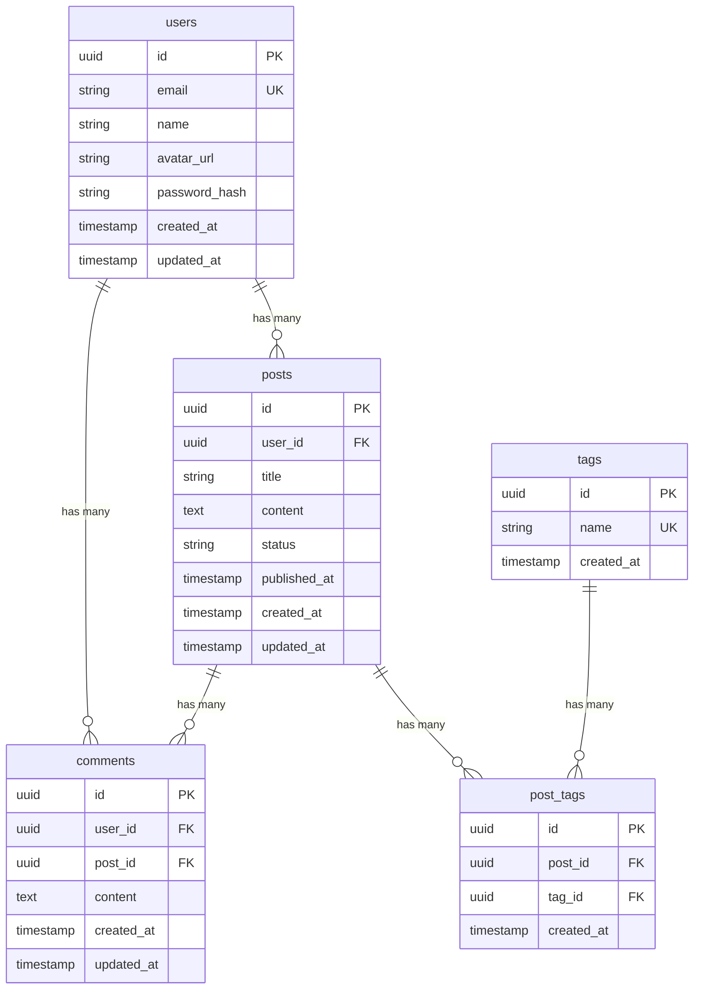

# DB 設計書テンプレート

> **カテゴリ**: 仕様書テンプレート
> **前提**: React + TypeScript + TailwindCSS + アトミックデザイン
> **難易度**: ★★★☆☆
> **所要時間目安**: 20〜40分

## このプロンプトの使い方

バックエンド（Supabase、Firebase、自前API等）と連携するプロジェクトで、データベーススキーマを設計する際に使用します。フロントエンドの型定義との整合性を保つために、フロントエンド側からも仕様を定義しておくと有用です。

---

## プロンプト

````text
以下のテンプレートに従い、データベース設計書を作成してください。
DATABASE_SCHEMA.md として保存してください。

━━━━━━━━━━━━━━━━━━━━━━━━━━━━━━
■ DB 設計書テンプレート
━━━━━━━━━━━━━━━━━━━━━━━━━━━━━━

```markdown
# データベース設計書

## 1. 概要

### 1.1 使用するデータベース

| 項目 | 内容 |
|------|------|
| DBMS | PostgreSQL / MySQL / Firestore / Supabase 等 |
| ホスティング | Supabase / PlanetScale / Firebase / 自前 等 |
| ORM | Prisma / Drizzle / なし（REST API 経由） |

### 1.2 設計方針

- テーブル名は英語の複数形（snake_case）
- カラム名は snake_case
- すべてのテーブルに `id`, `created_at`, `updated_at` を含める
- 論理削除を使用する場合は `deleted_at` カラムを追加
- UUID を主キーとして使用

---

## 2. ER 図



---

## 3. テーブル定義

### 3.1 users（ユーザー）

| カラム名 | 型 | NULL | デフォルト | 制約 | 説明 |
|---------|-----|------|-----------|------|------|
| id | UUID | NO | gen_random_uuid() | PK | ユーザーID |
| email | VARCHAR(255) | NO | - | UNIQUE | メールアドレス |
| name | VARCHAR(100) | NO | - | - | 表示名 |
| avatar_url | TEXT | YES | NULL | - | アバター画像URL |
| password_hash | VARCHAR(255) | NO | - | - | パスワードハッシュ |
| created_at | TIMESTAMP | NO | CURRENT_TIMESTAMP | - | 作成日時 |
| updated_at | TIMESTAMP | NO | CURRENT_TIMESTAMP | - | 更新日時 |

**インデックス**

| インデックス名 | カラム | 種別 |
|-------------|--------|------|
| idx_users_email | email | UNIQUE |

---

### 3.2 posts（投稿）

| カラム名 | 型 | NULL | デフォルト | 制約 | 説明 |
|---------|-----|------|-----------|------|------|
| id | UUID | NO | gen_random_uuid() | PK | 投稿ID |
| user_id | UUID | NO | - | FK(users.id) | 投稿者ID |
| title | VARCHAR(200) | NO | - | - | タイトル |
| content | TEXT | NO | - | - | 本文 |
| status | VARCHAR(20) | NO | 'draft' | CHECK | ステータス (draft/published/archived) |
| published_at | TIMESTAMP | YES | NULL | - | 公開日時 |
| created_at | TIMESTAMP | NO | CURRENT_TIMESTAMP | - | 作成日時 |
| updated_at | TIMESTAMP | NO | CURRENT_TIMESTAMP | - | 更新日時 |

**インデックス**

| インデックス名 | カラム | 種別 |
|-------------|--------|------|
| idx_posts_user_id | user_id | NORMAL |
| idx_posts_status | status | NORMAL |
| idx_posts_published_at | published_at | NORMAL |

**外部キー**

| カラム | 参照先 | ON DELETE |
|--------|--------|----------|
| user_id | users(id) | CASCADE |

---

## 4. フロントエンド型マッピング

DB のテーブルとフロントエンドの TypeScript 型の対応を定義する。

```typescript
// === users テーブル ===

/** ユーザー型（フロントエンド） */
interface User {
  /** ユーザーID */
  id: string;
  /** メールアドレス */
  email: string;
  /** 表示名 */
  name: string;
  /** アバター画像URL */
  avatarUrl: string | null;
  /** 作成日時 (ISO 8601) */
  createdAt: string;
  /** 更新日時 (ISO 8601) */
  updatedAt: string;
}

// === posts テーブル ===

/** 投稿ステータス */
type PostStatus = 'draft' | 'published' | 'archived';

/** 投稿型（フロントエンド） */
interface Post {
  /** 投稿ID */
  id: string;
  /** 投稿者ID */
  userId: string;
  /** タイトル */
  title: string;
  /** 本文 */
  content: string;
  /** ステータス */
  status: PostStatus;
  /** 公開日時 */
  publishedAt: string | null;
  /** 作成日時 */
  createdAt: string;
  /** 更新日時 */
  updatedAt: string;
}

/** 投稿（ユーザー情報付き） */
interface PostWithUser extends Post {
  /** 投稿者情報 */
  user: Pick<User, 'id' | 'name' | 'avatarUrl'>;
}
```

### 命名変換ルール

| DB (snake_case) | TypeScript (camelCase) |
|----------------|----------------------|
| user_id | userId |
| avatar_url | avatarUrl |
| created_at | createdAt |
| published_at | publishedAt |

---

## 5. マイグレーション管理

| # | マイグレーション名 | 内容 | 日付 |
|---|-----------------|------|------|
| 001 | create_users | users テーブル作成 | YYYY-MM-DD |
| 002 | create_posts | posts テーブル作成 | YYYY-MM-DD |
| 003 | create_comments | comments テーブル作成 | YYYY-MM-DD |
| 004 | create_tags | tags, post_tags テーブル作成 | YYYY-MM-DD |

---

## 6. シードデータ

開発・テスト用の初期データ。

```json
{
  "users": [
    {
      "id": "usr_001",
      "email": "admin@example.com",
      "name": "管理者",
      "avatar_url": null
    },
    {
      "id": "usr_002",
      "email": "user@example.com",
      "name": "テストユーザー",
      "avatar_url": null
    }
  ]
}
```

---

## 7. 更新履歴

| 日付 | 版 | 更新者 | 内容 |
|------|-----|--------|------|
| YYYY-MM-DD | 1.0 | | 初版作成 |
```

━━━━━━━━━━━━━━━━━━━━━━━━━━━━━━
■ 作成時の注意事項
━━━━━━━━━━━━━━━━━━━━━━━━━━━━━━
- ER図は Mermaid で記述し、リレーションを明示すること
- すべてのテーブルにインデックス定義を含めること
- フロントエンドの TypeScript 型とのマッピングを必ず含めること（DB: snake_case → TS: camelCase）
- 型定義には JSDoc コメントを付け、any は使用しないこと
- マイグレーション管理セクションを含めること
- 完成後、AGENTS.md の規約に照らし合わせてセルフチェックを行い、結果を報告する
````

---

## カスタマイズポイント

| 箇所 | 説明 |
|------|------|
| DBMS | 使用するデータベースに合わせて型を調整 |
| 主キー | UUID以外（連番ID等）を使う場合は変更 |
| 論理削除 | deleted_at を使うか、物理削除にするか |
| タイムゾーン | TIMESTAMP WITH TIME ZONE の使用を検討 |

---

## 関連プロンプト

- [API仕様書テンプレート](./04_api-specification.md) — DB設計と連動するAPI仕様
- [技術設計書テンプレート](./02_technical-design.md) — 全体のアーキテクチャ設計
- [データ取得レイヤー](../02_feature-prompts/03_data-fetching.md) — フロントエンドからのデータ取得実装
