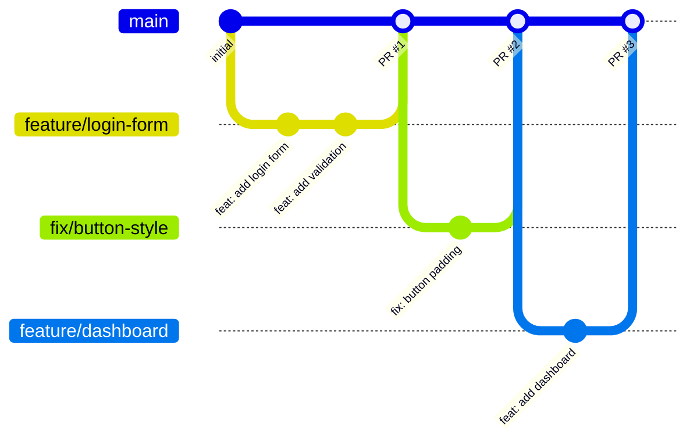

# Git ブランチ戦略

> **カテゴリ**: 開発ワークフロー
> **前提**: React + TypeScript + TailwindCSS + アトミックデザイン
> **難易度**: ★★☆☆☆
> **所要時間目安**: 15〜30分

## このプロンプトの使い方

プロジェクトの Git ブランチ戦略を決定し、関連する設定（保護ブランチ、命名規則等）を整備する際に使用します。

---

## プロンプト

````text
以下のガイドラインに従い、プロジェクトの Git ブランチ戦略を策定し、設定ファイルを整備してください。

━━━━━━━━━━━━━━━━━━━━━━━━━━━━━━
■ 推奨: GitHub Flow（シンプル版）
━━━━━━━━━━━━━━━━━━━━━━━━━━━━━━



### フロー
1. `main` ブランチから feature ブランチを作成
2. feature ブランチで開発
3. Pull Request を作成
4. レビュー → マージ
5. `main` へのマージで自動デプロイ

━━━━━━━━━━━━━━━━━━━━━━━━━━━━━━
■ ブランチ命名規則
━━━━━━━━━━━━━━━━━━━━━━━━━━━━━━

| プレフィックス | 用途 | 例 |
|-------------|------|-----|
| `feature/` | 新機能の追加 | `feature/user-authentication` |
| `fix/` | バグ修正 | `fix/login-redirect-loop` |
| `docs/` | ドキュメント更新 | `docs/api-specification` |
| `refactor/` | リファクタリング | `refactor/state-management` |
| `style/` | スタイル修正 | `style/button-hover-animation` |
| `test/` | テスト追加・修正 | `test/auth-flow-e2e` |
| `chore/` | 設定・ツール | `chore/eslint-config-update` |
| `hotfix/` | 緊急修正 | `hotfix/critical-xss-fix` |

命名規則: `{prefix}/{kebab-case-description}`

━━━━━━━━━━━━━━━━━━━━━━━━━━━━━━
■ コミットメッセージ規約
━━━━━━━━━━━━━━━━━━━━━━━━━━━━━━
Conventional Commits + 日本語説明:

```
feat: add user login form (ログインフォームを追加)
fix: resolve redirect loop on login (ログイン時のリダイレクトループを修正)
docs: update API specification (API仕様書を更新)
style: adjust button hover animation (ボタンホバーアニメーションを調整)
refactor: migrate state to Zustand (状態管理をZustandに移行)
test: add e2e test for auth flow (認証フローのE2Eテストを追加)
chore: update ESLint configuration (ESLint設定を更新)

BREAKING CHANGE: API response format changed (APIレスポンス形式の変更)
```

━━━━━━━━━━━━━━━━━━━━━━━━━━━━━━
■ 保護ブランチ設定
━━━━━━━━━━━━━━━━━━━━━━━━━━━━━━
GitHub リポジトリの Settings > Branches で以下を設定:
- `main` ブランチを保護
- PR 必須（直接 push 禁止）
- ステータスチェック必須（CI パス必須）
- 最新の main とのマージ必須

━━━━━━━━━━━━━━━━━━━━━━━━━━━━━━
■ 生成するファイル
━━━━━━━━━━━━━━━━━━━━━━━━━━━━━━
1. `CONTRIBUTING.md` — コントリビューションガイド（ブランチ戦略、コミット規約含む）
2. `.github/ISSUE_TEMPLATE/bug_report.md` — バグ報告テンプレート
3. `.github/ISSUE_TEMPLATE/feature_request.md` — 機能リクエストテンプレート

━━━━━━━━━━━━━━━━━━━━━━━━━━━━━━
■ タスク完了時
━━━━━━━━━━━━━━━━━━━━━━━━━━━━━━
AGENTS.md の「タスク完了時の確認事項」に従い報告してください。
````

---

## 関連プロンプト

- [PRテンプレート＆レビュー規約](./02_pr-review-template.md) — PR の標準化
- [リリースプロセス](./03_release-process.md) — リリース管理
